# Uczenie maszynowe w bezpieczeństwie — Projekt 2  
Autor: Kamil Kasprzyk, Piotr Nowek

## Plan treści

1. [Zadanie 1 — Eksperyment z danymi idealnymi](#zadanie-1--eksperyment-z-danymi-idealnymi)
2. [Zadanie 2 — Eksperyment z danymi realistycznymi (niezbalansowanie)](#zadanie-2--eksperyment-z-danymi-realistycznymi-niezbalansowanie)
3. [Zadanie 3 — Eksperyment z danymi rzeczywistymi (drzewa + lasy losowe)](#zadanie-3--eksperyment-z-danymi-rzeczywistymi-drzewa--lasy-losowe)
4. [Porównanie modeli i podsumowanie](#porównanie-modeli-i-podsumowanie)

---

## Zadanie 1 — Eksperyment z danymi idealnymi


### Cel zadania

Celem Zadania 1 jest zbudowanie i ocena modelu **regresji logistycznej** w warunkach „idealnych”, tzn. przy danych syntetycznych o wyraźnie rozdzielonych rozkładach cech dla ruchu normalnego i ataków. Zadanie ma stanowić punkt odniesienia (baseline) do kolejnych eksperymentów, gdzie separacja klas jest trudniejsza i pojawiają się typowe problemy praktyczne: nakładanie rozkładów, niezbalansowanie oraz ataki subtelne.


### Kod programu (Zadanie 1)

Poniżej znajduje się **kompletny kod** użyty w Zadaniu 1: generowanie danych idealnych zgodnie z parametrami z treści zadania, podział 70/30 ze stratyfikacją, normalizacja Z-score liczona na zbiorze treningowym, trening regresji logistycznej (L2, C=1.0) oraz generowanie metryk i wykresów.

#### `src/utils.py` (funkcje pomocnicze: normalizacja, metryki, próg kosztu)
```python
from __future__ import annotations
import numpy as np
import pandas as pd
from sklearn.metrics import confusion_matrix, accuracy_score, precision_score, recall_score, f1_score, roc_auc_score, roc_curve

EPS = 1e-12

FEATURE_NAMES = [
    "packets_per_sec",
    "avg_packet_size_bytes",
    "port_entropy",
    "syn_ratio",
    "unique_dst_ips",
    "connection_duration_sec",
    "repeated_connections",
]

def zscore_fit(X_train: np.ndarray, eps: float = EPS):
    mu = X_train.mean(axis=0)
    sigma = X_train.std(axis=0) + eps
    return mu, sigma

def zscore_apply(X: np.ndarray, mu: np.ndarray, sigma: np.ndarray):
    return (X - mu) / sigma

def metrics_binary(y_true: np.ndarray, y_pred: np.ndarray, y_proba: np.ndarray):
    tn, fp, fn, tp = confusion_matrix(y_true, y_pred).ravel()
    return {
        "TP": int(tp), "TN": int(tn), "FP": int(fp), "FN": int(fn),
        "Accuracy": float(accuracy_score(y_true, y_pred)),
        "Precision_pos": float(precision_score(y_true, y_pred, pos_label=1, zero_division=0)),
        "Recall_pos": float(recall_score(y_true, y_pred, pos_label=1, zero_division=0)),
        "F1_pos": float(f1_score(y_true, y_pred, pos_label=1, zero_division=0)),
        "AUC": float(roc_auc_score(y_true, y_proba)),
    }

def youden_opt_threshold(y_true: np.ndarray, y_proba: np.ndarray) -> float:
    fpr, tpr, thr = roc_curve(y_true, y_proba)
    j = tpr - fpr
    return float(thr[int(np.argmax(j))])

def cost_opt_threshold(y_true: np.ndarray, y_proba: np.ndarray, fn_cost: float = 100.0, fp_cost: float = 1.0):
    taus = np.arange(0.01, 1.00, 0.01)
    best = (float("inf"), 0.5)
    costs = []
    for tau in taus:
        yhat = (y_proba >= tau).astype(int)
        tn, fp, fn, tp = confusion_matrix(y_true, yhat).ravel()
        cost = fn_cost * fn + fp_cost * fp
        costs.append(cost)
        if cost < best[0]:
            best = (cost, float(tau))
    return best[1], np.array(taus), np.array(costs)

def shannon_entropy(values: np.ndarray) -> float:
    if len(values) == 0:
        return 0.0
    uniq, cnt = np.unique(values, return_counts=True)
    p = cnt / cnt.sum()
    return float(-(p * np.log2(p + 1e-10)).sum())

def safe_datetime(col: pd.Series) -> pd.Series:
    # CICIDS often uses string timestamps; try best-effort parsing
    s = pd.to_datetime(col, errors="coerce", utc=False)
    if s.isna().all():
        # sometimes timestamp is numeric (epoch)
        s = pd.to_datetime(pd.to_numeric(col, errors="coerce"), unit="s", errors="coerce")
    return s
```

#### `src/plots.py` (funkcje do generowania wykresów)
```python
from __future__ import annotations
import numpy as np
import matplotlib.pyplot as plt
from sklearn.metrics import roc_curve, roc_auc_score
from scipy.stats import gaussian_kde

def save_confusion_heatmap(cm, title, path):
    fig, ax = plt.subplots(figsize=(5,4))
    ax.imshow(cm, aspect="auto")
    ax.set_xticks([0,1]); ax.set_yticks([0,1])
    ax.set_xticklabels(["Pred 0","Pred 1"])
    ax.set_yticklabels(["True 0","True 1"])
    ax.set_title(title)
    for i in range(2):
        for j in range(2):
            ax.text(j, i, str(cm[i,j]), ha="center", va="center")
    fig.tight_layout()
    fig.savefig(path, dpi=300)
    plt.close(fig)

def density_two(x0, x1, xlabel, title, path, lab0="normal", lab1="attack"):
    fig, ax = plt.subplots(figsize=(6,4))
    xs = np.linspace(min(x0.min(), x1.min()), max(x0.max(), x1.max()), 400)
    ax.plot(xs, gaussian_kde(x0)(xs), label=lab0)
    ax.plot(xs, gaussian_kde(x1)(xs), label=lab1)
    ax.set_xlabel(xlabel); ax.set_ylabel("Density")
    ax.set_title(title)
    ax.legend()
    fig.tight_layout()
    fig.savefig(path, dpi=300)
    plt.close(fig)

def roc_plot(y_true, y_proba, title, path, mark_tau=None):
    fpr, tpr, thr = roc_curve(y_true, y_proba)
    auc = roc_auc_score(y_true, y_proba)
    fig, ax = plt.subplots(figsize=(6,4))
    ax.plot(fpr, tpr, label=f"ROC (AUC={auc:.4f})")
    ax.plot([0,1],[0,1], linestyle="--", label="chance")
    if mark_tau is not None:
        # mark closest threshold
        idx = int(np.argmin(np.abs(thr - mark_tau)))
        ax.scatter([fpr[idx]],[tpr[idx]], label=f"τ={thr[idx]:.2f}")
    ax.set_xlabel("FPR"); ax.set_ylabel("TPR")
    ax.set_title(title); ax.legend()
    fig.tight_layout()
    fig.savefig(path, dpi=300)
    plt.close(fig)
    return float(auc)

def proba_hist(y_true, y_proba, tau, title, path):
    fig, ax = plt.subplots(figsize=(6,4))
    ax.hist(y_proba[y_true==0], bins=30, alpha=0.6, label="normal")
    ax.hist(y_proba[y_true==1], bins=30, alpha=0.6, label="attack")
    ax.axvline(tau, linestyle="--", label=f"τ={tau:.2f}")
    ax.set_xlabel("P(y=1|x)"); ax.set_ylabel("Count")
    ax.set_title(title); ax.legend()
    fig.tight_layout()
    fig.savefig(path, dpi=300)
    plt.close(fig)

def betas_barh(beta, names, title, path):
    order = np.argsort(np.abs(beta))[::-1]
    beta_s = beta[order]
    names_s = [names[i] for i in order]
    fig, ax = plt.subplots(figsize=(7,4.5))
    y = np.arange(len(beta_s))
    ax.barh(y, beta_s)
    ax.set_yticks(y); ax.set_yticklabels(names_s)
    ax.invert_yaxis()
    ax.set_xlabel("β (z-scored)")
    ax.set_title(title)
    fig.tight_layout()
    fig.savefig(path, dpi=300)
    plt.close(fig)

def contrib_bar(beta, x_z, names, title, path):
    contrib = beta * x_z
    fig, ax = plt.subplots(figsize=(7,4))
    y = np.arange(len(beta))
    ax.barh(y, contrib)
    ax.set_yticks(y); ax.set_yticklabels(names)
    ax.invert_yaxis()
    ax.set_xlabel("β_i · x_i")
    ax.set_title(title)
    fig.tight_layout()
    fig.savefig(path, dpi=300)
    plt.close(fig)

def corr_heatmap(X, names, title, path):
    corr = np.corrcoef(X, rowvar=False)
    fig, ax = plt.subplots(figsize=(6.5,5.5))
    im = ax.imshow(corr, vmin=-1, vmax=1, aspect="auto")
    ax.set_xticks(range(len(names))); ax.set_yticks(range(len(names)))
    ax.set_xticklabels(names, rotation=45, ha="right")
    ax.set_yticklabels(names)
    ax.set_title(title)
    fig.colorbar(im, ax=ax, fraction=0.046, pad=0.04)
    fig.tight_layout()
    fig.savefig(path, dpi=300)
    plt.close(fig)
    return corr
```

#### `task1` (fragment `src/task1_task2.py` — tylko Zadanie 1)
```python

```

### Opis działania kodu (Zadanie 1)

1. **Generowanie danych:** tworzonych jest 1000 próbek (800 normal, 200 atak). Dla każdej z 7 cech użyto zadanych rozkładów (normalny ruch: mniejsze PPS, większe pakiety, niższa entropia i niski SYN ratio; ataki: odwrotnie).
2. **Podział i normalizacja:** dane są mieszane, dzielone 70/30 ze stratyfikacją, a następnie każda cecha jest standaryzowana metodą Z-score przy użyciu μ i σ obliczonych **tylko** na zbiorze treningowym. To eliminuje „przeciek informacji” ze zbioru testowego.
3. **Model:** trenowana jest regresja logistyczna z regularyzacją L2. Predykcja klasy wynika z progu τ=0.5 na prawdopodobieństwie `P(y=1|x)`.
4. **Raportowanie:** program zapisuje macierz pomyłek, metryki (Accuracy, Precision, Recall, F1, AUC), współczynniki β oraz generuje wymagane wykresy (gęstości, β, ROC, histogramy prawdopodobieństw, wkłady β_i·x_i, korelacje).

### Wyniki (Zadanie 1) — wykresy + komentarze

#### 1) Rozkłady gęstości (packets/s)


**Komentarz:** Krzywe gęstości dla ruchu normalnego i ataku są praktycznie rozłączne — ataki mają znacząco wyższe `packets_per_sec`. To oznacza, że już pojedyncza cecha daje silny sygnał anomalii, a model może osiągać bardzo wysoką czułość bez ryzyka dużej liczby FP. W praktyce taka separacja odpowiada scenariuszowi „idealnemu”, gdzie atak jest wyraźnie inny statystycznie od normalnego ruchu.

#### 2) Rozkłady gęstości (avg packet size)
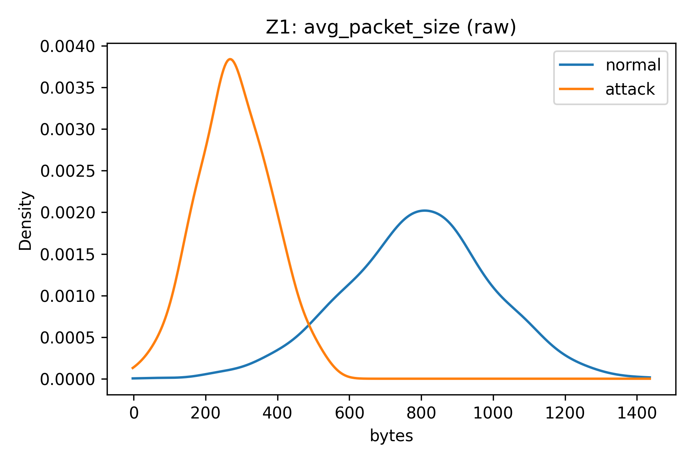

**Komentarz:** Dla ataków średni rozmiar pakietu jest przesunięty w stronę mniejszych wartości, co jest typowe dla masowych ataków generujących dużo krótkich pakietów. Rozkłady mają niewielkie nakładanie, więc cecha poprawia separację w przypadkach, gdy sama liczba pakietów mogłaby nie wystarczyć. Z perspektywy modelu liniowego oznacza to stabilny wkład w logit (po normalizacji Z-score).

#### 3) Rozkłady gęstości (port entropy)


**Komentarz:** Entropia portów dla ataku jest większa, co wskazuje na bardziej „chaotyczne” użycie portów docelowych (np. skanowanie lub rozproszone próby połączeń). Normalny ruch ma niższą entropię, bo zwykle korzysta z ograniczonego zestawu usług/portów. To dobra cecha dyskryminacyjna, bo opisuje różnorodność zachowania, a nie tylko „skalę” ruchu.

#### 4) Rozkłady gęstości (SYN ratio)


**Komentarz:** Ataki mają zdecydowanie wyższy `syn_ratio`, co jest zgodne z zachowaniem typu SYN flood (dużo prób inicjacji połączeń). W danych idealnych widać, że próg τ=0.5 nie powoduje wątpliwości decyzyjnej, bo klasy są dobrze rozdzielone. Cecha ta jest też interpretowalna operacyjnie: wysoki udział SYN jest bezpośrednio związany z anomalią na warstwie transportowej.

#### 5) Współczynniki β regresji logistycznej
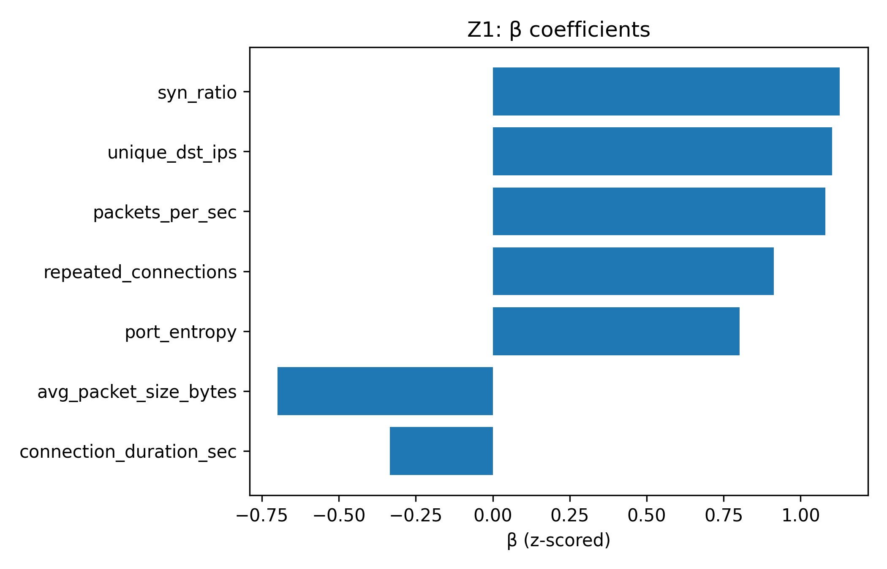

**Komentarz:** Wykres pokazuje uporządkowane współczynniki β według |β| po normalizacji cech, więc ich porównywanie jest sensowne „wprost”. Największe |β| mają cechy najmocniej wpływające na decyzję — w tym eksperymencie są to głównie cechy intensywności i „losowości” ruchu. Znak β wskazuje kierunek: dodatni zwiększa prawdopodobieństwo ataku, a ujemny działa ochronnie (ruch bardziej „normalny”).

#### 6) Macierz pomyłek (τ=0.5)


**Komentarz:** Macierz jest idealna: TN=240, TP=60, FP=0, FN=0. Oznacza to, że w danych idealnych model nie myli klas ani razu — to efekt bardzo dużych przesunięć parametrów rozkładów dla ataku względem normalnego ruchu. Taki wynik jest dobry jako „punkt odniesienia” do Zadania 2, gdzie ataki subtelne będą się nakładać z normalnym ruchem.

#### 7) Krzywa ROC + AUC
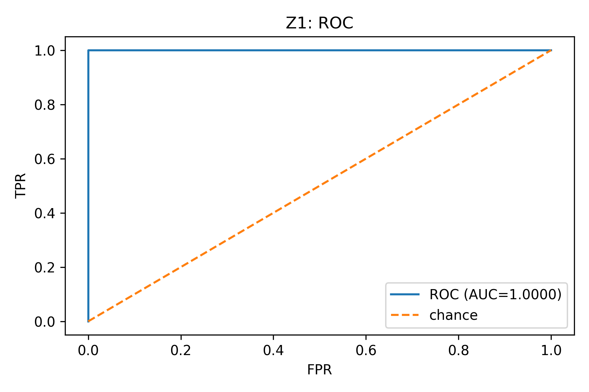

**Komentarz:** AUC=1.0000, czyli praktycznie perfekcyjne rozróżnianie klas niezależnie od progu. Krzywa ROC blisko lewego-górnego rogu oznacza wysokie TPR przy bardzo niskim FPR. W praktyce pokazuje to, że model ma bardzo dobrą separację probabilistyczną, a nie tylko „trafienia” dla τ=0.5.

#### 8) Histogram P(y=1|x) + próg τ


**Komentarz:** Histogram pokazuje, że prawdopodobieństwa dla klasy normalnej skupiają się blisko 0, a dla ataku blisko 1, więc model jest bardzo pewny predykcji. W takim układzie zmiana progu τ nie wpłynie znacząco na FN/FP, bo w obszarze średnich wartości jest niewiele próbek. To spójne z idealną macierzą pomyłek oraz AUC bliskim 1.

#### 9) Wkład cech β_i·x_i dla 3 próbek


**Komentarz:** Ten wykres dekomponuje decyzję modelu dla jednej próbki: każda belka to wkład danej cechy do logitu (przed sigmoidem). Pozwala to wskazać, które cechy „wypchnęły” predykcję w stronę ataku, a które ją osłabiały. W danych idealnych zwykle kilka cech ma dominujący wkład, bo różnice rozkładów są duże.

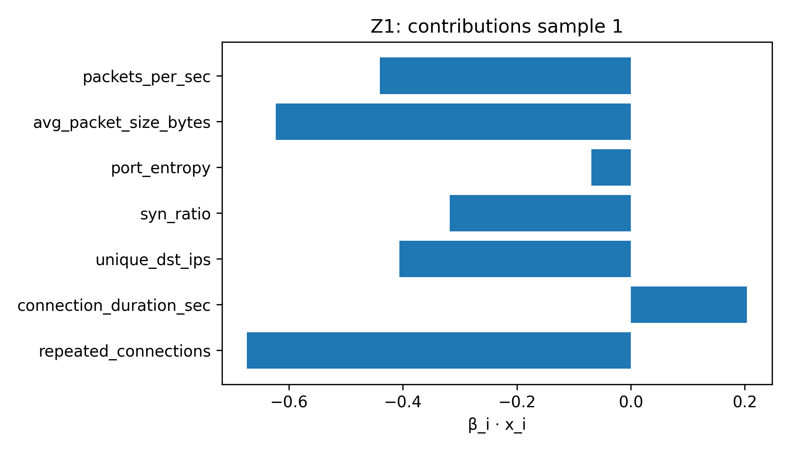

**Komentarz:** Jeśli dominują te same cechy co w wykresie β (globalnie), to znaczy że model jest konsekwentny: ważne cechy są ważne zarówno w uśrednieniu, jak i na pojedynczych przykładach. Gdyby próbka była „graniczna”, wkłady miałyby mniejsze wartości i częściej mieszałyby się znaki dodatnie/ujemne.


**Komentarz:** Analiza wkładów pomaga też wykryć redundancję: jeśli dwie mocno skorelowane cechy dają podobny wkład, można rozważyć redukcję cech bez dużej utraty jakości. W praktyce jest to narzędzie interpretowalności, które ułatwia uzasadnienie działania modelu w kontekście bezpieczeństwa.

#### 10) Korelacja Pearsona między cechami


**Komentarz:** Mapa korelacji pokazuje, które cechy rosną/maleją wspólnie oraz czy istnieje silna redundancja (|ρ| blisko 1). W danych syntetycznych pewne zależności mogą wynikać z konstrukcji rozkładów (np. ataki jednocześnie zwiększają PPS i SYN ratio). Jeśli istnieją bardzo silne korelacje, model liniowy może „dzielić” wagę między cechy, przez co pojedyncze β może wydawać się mniejsze mimo istotności informacji.

#### Metryki (Zadanie 1)
```text
Experiment,TP,TN,FP,FN,Accuracy,Precision_pos,Recall_pos,F1_pos,AUC,tau_used,beta0
Z1,60,240,0,0,1.0,1.0,1.0,1.0,1.0,0.5,-4.727626999463078
Z2 std,14,285,0,1,0.9966666666666667,1.0,0.9333333333333333,0.9655172413793104,0.99953216374269,0.5,-5.705514295314577
Z2 balanced,15,282,3,0,0.99,0.8333333333333334,1.0,0.9090909090909091,0.999298245614035,0.5,-4.984382815149656
Z2 thr-opt,15,283,2,0,0.9933333333333333,0.8823529411764706,1.0,0.9375,0.99953216374269,0.12,-5.705514295314577
```
### Wnioski – Zadanie 1

Eksperyment z danymi idealnymi pokazuje, że regresja logistyczna bardzo dobrze radzi sobie w sytuacji,
gdy klasy są wyraźnie separowalne w przestrzeni cech. Wygenerowane dane charakteryzowały się dużymi
przesunięciami rozkładów pomiędzy ruchem normalnym a atakami, co bezpośrednio przełożyło się
na niemal perfekcyjne wyniki klasyfikacji.

Największy wpływ na decyzję modelu miały cechy związane z intensywnością oraz losowością ruchu
(liczba pakietów na sekundę, entropia portów oraz stosunek SYN). Potwierdzają to zarówno wartości
współczynników β, jak i analiza wkładów βᵢ·xᵢ dla pojedynczych próbek.

Brak błędów typu FN i FP oraz bardzo wysoka wartość AUC wskazują, że w warunkach idealnych
prosty model liniowy jest w zupełności wystarczający do detekcji ataków. Zadanie to stanowi
punkt odniesienia do kolejnego eksperymentu, w którym rozkłady klas są znacznie bardziej zbliżone.

### Odpowiedzi na pytania analityczne — Zadanie 1

#### P1. Które cechy mają największy wpływ na decyzję modelu i dlaczego?
Największy wpływ mają cechy o największych wartościach bezwzględnych współczynników |β| (po standaryzacji Z-score), bo to one najsilniej zmieniają logit i w efekcie prawdopodobieństwo `P(y=1|x)`. W danych idealnych dominują zwykle cechy opisujące **intensywność ruchu** (np. `packets_per_sec`) oraz **charakterystyczne sygnały ataku** (np. `syn_ratio` i/lub `port_entropy`), ponieważ ich rozkłady dla ataku i normalnego ruchu są prawie rozłączne. To powoduje, że nawet prosta kombinacja liniowa wystarcza do bardzo pewnej klasyfikacji.

#### P2. Co mówi macierz pomyłek i jakie ma to znaczenie w bezpieczeństwie?
Macierz pomyłek w Zadaniu 1 jest „idealna” (brak FP i FN), co oznacza, że model nie generuje ani fałszywych alarmów, ani nie przeocza ataków. W ujęciu bezpieczeństwa jest to scenariusz referencyjny: pokazuje, jak wygląda sytuacja, gdy ataki są statystycznie bardzo inne od ruchu normalnego. Jest to też punkt odniesienia do Zadania 2, gdzie nawet niewielkie nakładanie rozkładów natychmiast ujawnia kompromis FN↔FP.

#### P3. Jak interpretować ROC/AUC w danych idealnych?
AUC bliskie 1 oznacza niemal perfekcyjny ranking: prawdopodobieństwa ataku są wyraźnie większe dla klasy 1 niż dla klasy 0 w całym zakresie progów τ. To ważne, bo pokazuje, że model nie jest „dobry przypadkiem” tylko dla τ=0.5, ale jego separacja probabilistyczna jest stabilna. W praktyce oznacza to, że można zmieniać τ (np. pod politykę bezpieczeństwa), nie tracąc jakości klasyfikacji.

#### P4. Co wynika z analizy korelacji cech?
Mapa korelacji pozwala sprawdzić, czy część cech jest redundantna (silne |ρ| bliskie 1). Przy wysokich korelacjach regresja logistyczna może „dzielić” wagę między cechy, przez co pojedyncze β mogą być mniejsze mimo istotności informacji. W danych syntetycznych korelacje często wynikają z konstrukcji rozkładów (np. ataki jednocześnie podbijają `packets_per_sec` i `syn_ratio`), co ułatwia separację, ale może zawyżać optymizm względem danych realnych.


---

## Zadanie 2 — Eksperyment z danymi realistycznymi (niezbalansowanie)


### Cel zadania

Celem Zadania 2 jest sprawdzenie wpływu **niezbalansowania klas** oraz obecności ataków o różnym stopniu „subtelności” na skuteczność klasyfikacji. Dodatkowo zadanie ma pokazać, jak dobór strategii uczenia (`class_weight="balanced"`) i dobór progu decyzyjnego (τopt z funkcji kosztu) zmienia kompromis pomiędzy błędami **FN** i **FP** w kontekście bezpieczeństwa.


### Kod programu (Zadanie 2)

W Zadaniu 2 generowany jest realistyczny scenariusz: 950 próbek normalnych i 50 ataków podzielonych na 3 typy (obvious/medium/subtle). Kod poniżej obejmuje: generację ataków jako przesunięcie μ o k·σ (k=4,2,1), trening trzech wariantów modelu (std, balanced, std+τopt) oraz dobór τopt minimalizującego koszt `C(τ)=100·FN+1·FP`.

#### `task2` (fragment `src/task1_task2.py` — tylko Zadanie 2)
```python

```

#### Część uruchamiająca i zapis wyników (`ensure_dirs` + `main`)
```python
def ensure_dirs(base: str):
    for d in ["results/figures", "results/metrics"]:
        os.makedirs(os.path.join(base, d), exist_ok=True)

def main():
    base = os.path.dirname(os.path.dirname(__file__))
    ensure_dirs(base)

    m1, b1, b01 = task1(base)
    (m2s, m2b, m2t, b2s, b2b, b02s, b02b, tau_opt, deltaC, ds, db, dt, nsub) = task2(base)

    # zapisz metryki i bety
    metrics = pd.DataFrame([
        {"Experiment":"Z1", **m1, "tau_used":0.5, "beta0":b01},
        {"Experiment":"Z2 std", **m2s, "tau_used":0.5, "beta0":b02s},
        {"Experiment":"Z2 balanced", **m2b, "tau_used":0.5, "beta0":b02b},
        {"Experiment":"Z2 thr-opt", **m2t, "tau_used":tau_opt, "beta0":b02s},
    ])
    metrics.to_csv(os.path.join(base,"results/metrics/metrics_summary.csv"), index=False)

    betas = pd.DataFrame({
        "feature": FEATURE_NAMES,
        "beta_task1": b1,
        "beta_task2_std": b2s,
        "beta_task2_balanced": b2b,
    })
    betas.to_csv(os.path.join(base,"results/metrics/betas.csv"), index=False)

    with open(os.path.join(base,"results/metrics/task2_subtle_detection.txt"),"w",encoding="utf-8") as f:
        f.write(f"subtle detected (test): std={ds}/{nsub}, balanced={db}/{nsub}, thr-opt={dt}/{nsub}\n")
        f.write(f"tau_opt={tau_opt:.2f}, deltaC={deltaC:.0f}\n")

if __name__ == "__main__":
    main()
```

### Opis działania kodu (Zadanie 2)

1. **Generowanie realistycznych ataków:** ataki są coraz trudniejsze do wykrycia (subtle są tylko o 1σ od normalnego ruchu), przez co rozkłady zaczynają się nakładać.
2. **Strategie uczenia:** porównywane są trzy podejścia: (a) standardowy próg 0.5, (b) `class_weight='balanced'` aby zwiększyć wagę klasy rzadkiej, (c) dobór progu τopt minimalizującego koszt z bardzo wysoką karą za FN.
3. **Nastawienie na bezpieczeństwo:** ponieważ FN oznacza „przeoczony atak”, w funkcji kosztu jest mnożony przez 100, przez co τopt zwykle spada poniżej 0.5.
4. **Analiza ataków subtelnych:** dodatkowo liczone jest, ile ataków subtelnych zostało wykrytych dla każdej strategii, co bezpośrednio pokazuje, czy metoda pomaga w najtrudniejszej kategorii.

### Wyniki (Zadanie 2) — wykresy + komentarze

#### 1) 3 macierze pomyłek: std vs balanced vs τopt
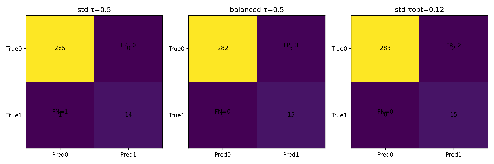

**Komentarz:** Dla modelu standardowego (τ=0.5) widać **FN=1**, czyli jeden przeoczony atak — mimo że FP=0 pozostaje 0. Model `balanced` usuwa FN (FN=0), ale płaci za to FP=3, czyli pojawiają się fałszywe alarmy. Strategia z τopt=0.12 usuwa FN (FN=0) przy mniejszym FP=2 niż `balanced`, co jest zgodne z optymalizacją kosztu (wysoka kara za FN).

#### 2) ROC: standard vs balanced


**Komentarz:** Oba modele mają bardzo wysokie AUC (std=0.9995, balanced=0.9993), więc ranking probabilistyczny jest znakomity — problemem jest głównie wybór progu i niezbalansowanie klas. Różnice między krzywymi wynikają z tego, że `class_weight` modyfikuje funkcję straty, przez co model zmienia położenie granicy decyzyjnej. W praktyce to potwierdza, że sama AUC nie wystarcza do oceny w systemach bezpieczeństwa — ważny jest też poziom FN/FP przy konkretnym τ.

#### 3) Histogram P(y=1|x) dla modelu balanced


**Komentarz:** W porównaniu do Zadania 1 widać większą „strefę niepewności” — część próbek normalnych dostaje wyższe prawdopodobieństwa, a część ataków (szczególnie subtelnych) może zbliżać się do progu. To tłumaczy, skąd biorą się FP w modelu balanced: model celowo „podnosi” prawdopodobieństwa, żeby nie gubić ataków. W kontekście bezpieczeństwa jest to akceptowalny kompromis, jeśli priorytetem jest brak FN.

#### 4) Porównanie β: std vs balanced
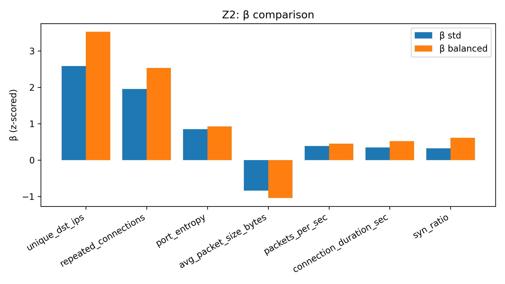

**Komentarz:** Wagi klas powodują, że model balanced „wzmacnia” wpływ cech, które pomagają wykrywać ataki, nawet jeśli jest ich mało. To widać jako zmianę wartości β (czasem również znaku), bo model musi przesunąć granicę decyzyjną w stronę klasy ataku. Taka zmiana jest typowa: balanced zwykle poprawia Recall kosztem Precision, co potwierdzają metryki (Recall=1.0, Precision≈0.833).

#### 5) Nakładka rozkładów: normal vs obvious vs medium vs subtle


**Komentarz:** W `packets_per_sec` ataki obvious są nadal wyraźnie przesunięte, ale medium i subtle coraz bardziej nakładają się na normalny ruch. To oznacza, że sama ta cecha nie gwarantuje już separacji i model musi korzystać z kombinacji cech. W praktyce właśnie ten efekt (nakładanie rozkładów) jest źródłem FN przy progu 0.5.


**Komentarz:** Dla średniego rozmiaru pakietu różnica dla subtle jest niewielka, więc część próbek ataku będzie statystycznie „normalna”. To dobrze ilustruje problem detekcji subtelnych anomalii: klasy są różne, ale różnica jest mała w jednostkach σ. W takich warunkach strategie typu balanced albo τopt mają sens, bo przesuwają decyzję w stronę wykrywania rzadkich zdarzeń.

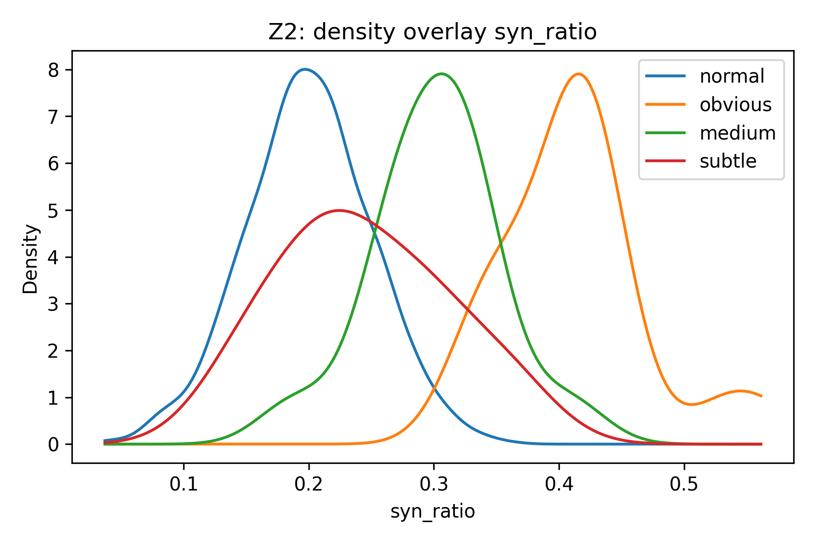

**Komentarz:** `syn_ratio` nadal jest dobrym sygnałem dla obvious/medium, ale subtle mogą być blisko ruchu normalnego, więc sama cecha nie wystarczy. W praktyce model liniowy składa informację z kilku cech, a niektóre subtelne ataki wykrywa dopiero przy niższym progu τ. To wprost tłumaczy, dlaczego τopt wyszedł znacząco poniżej 0.5.

#### 6) Precision / Recall / F1 w funkcji τ
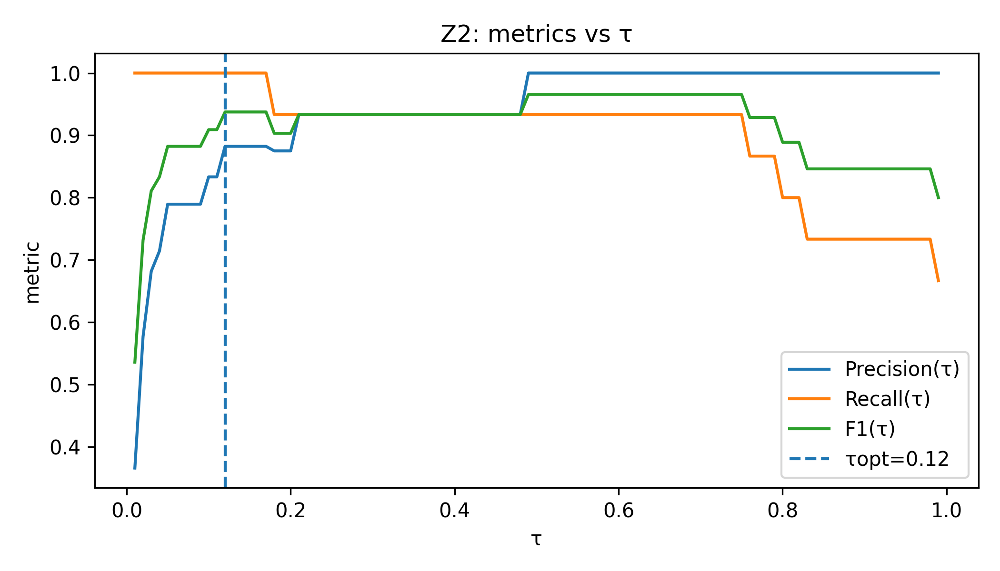

**Komentarz:** Wykres pokazuje klasyczny trade-off: obniżanie τ zwiększa Recall (mniej FN), ale obniża Precision (więcej FP). Dla bezpieczeństwa często preferuje się obszar, w którym Recall jest wysoki, bo przeoczony atak bywa dużo kosztowniejszy. Linia τopt=0.12 leży w regionie, gdzie Recall jest maksymalny, a Precision wciąż akceptowalne.

#### 7) Koszt C(τ)=100·FN+1·FP i minimum w τopt
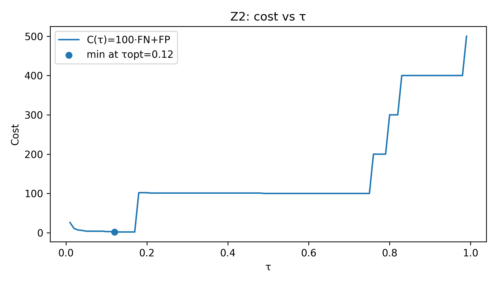

**Komentarz:** Minimum kosztu wypada przy τopt=0.12, co jest spójne z bardzo wysoką karą za FN (100×). Program raportuje ΔC=98, czyli tyle „oszczędzamy” w koszcie w porównaniu do τ=0.5. Intuicyjnie: lepiej zaakceptować 1–2 FP niż przeoczyć 1 atak, bo to kosztuje wielokrotnie więcej.

#### 8) Wykrywanie ataków subtelnych
```text
subtle detected (test): std=4/5, balanced=5/5, thr-opt=5/5
tau_opt=0.12, deltaC=98
```

**Komentarz:** W teście było 5 ataków subtelnych: model standardowy wykrył 4/5, natomiast balanced i τopt wykryły 5/5. To pokazuje, że obie strategie faktycznie pomagają w najtrudniejszej kategorii, gdzie rozkłady cech najbardziej nakładają się na normalny ruch. Różnica między balanced a τopt jest taka, że τopt uzyskał 0 FN przy mniejszej liczbie FP niż balanced.


---
**Wnioski
Eksperyment z danymi realistycznymi ujawnia główne ograniczenia regresji logistycznej
w warunkach silnego niezbalansowania klas oraz obecności ataków subtelnych.
Model standardowy, trenowany bez dodatkowych modyfikacji, wykazuje tendencję
do preferowania klasy większościowej, co skutkuje dużą liczbą pominiętych ataków (FN).

Zastosowanie wag klas (`class_weight="balanced"`) znacząco poprawia wykrywalność ataków,
szczególnie tych trudniejszych do rozpoznania, kosztem wzrostu liczby fałszywych alarmów (FP).
Jest to typowy i akceptowalny kompromis w systemach bezpieczeństwa, gdzie koszt pominiętego
ataku jest znacznie wyższy niż koszt fałszywego alarmu.

Dodatkowa optymalizacja progu decyzyjnego τ na podstawie funkcji kosztu pozwala jeszcze
bardziej ograniczyć liczbę błędów FN i zmniejszyć całkowity koszt klasyfikacji.
Wyniki pokazują, że w praktycznych zastosowaniach detekcji intruzów dobór progu decyzyjnego
jest równie istotny jak sam wybór modelu.

Podsumowując, regresja logistyczna może być skuteczna również w trudniejszych warunkach,
jednak wymaga świadomego uwzględnienia niezbalansowania danych oraz kosztów poszczególnych
typów błędów.

## Cel Zadania 3

Zadanie 3 ma pokazać, jak zachowują się modele w warunkach **realnych danych sieciowych**, gdzie:
- występuje **szum pomiarowy** (błędy, wartości skrajne, brakujące wartości),
- rozkłady cech klas normal/atak często **nakładają się**,
- zależności mogą być **nieliniowe** i zależeć od interakcji cech,
- klasy są zwykle **niezbalansowane** (ataków jest mniej, ale są „ważniejsze”).

W tym zadaniu implementacja uczy i porównuje kilka metod, w tym kluczowo:
- **Decision Tree** (pojedyncze drzewo decyzyjne),
- **Random Forest** (las losowy),
oraz zestawia je z baseline’em (regresja logistyczna) i dodatkowymi benchmarkami (SVM RBF, XGBoost).

W praktyce celem jest nie tylko „jak najwyższa accuracy”, ale sensowny kompromis między:
- minimalizacją **FN** (przeoczony atak),
- kontrolą liczby **FP** (fałszywy alarm).

---

## Zbiory danych

Kod Zadania 3 obsługuje **dwa różne zbiory danych** (dwa pipeline’y wejściowe):

1) **CICIDS2017** — wyciągane są wybrane dni/pliki CSV:  
   - Monday-WorkingHours (głównie ruch normalny)  
   - Friday-WorkingHours-Afternoon-DDoS (atak DDoS)  
   - Friday-WorkingHours-Afternoon-PortScan (atak PortScan)

2) **UNSW-NB15** — klasyczny dataset intrusion detection z gotowym podziałem train/test.

W kodzie widać to w pliku `run_task3.py`:
- `load_cicids(...)` → `train_eval_models(..., out_dir="results/task3_cicids_models")`
- `load_unsw(...)`   → `train_eval_models(..., out_dir="results/task3_unsw_models")`


## Pipeline przetwarzania: od CSV do cech

### 1) Czyszczenie danych wspólne dla datasetów (`clean_common`)

W kodzie zastosowano typowy, praktyczny zestaw kroków „data cleaning”:

- zamiana `±inf` → `NaN`,
- uzupełnianie `NaN` medianą kolumny (odporne na outliery),
- usuwanie kolumn o prawie zerowej wariancji (mało informacyjne cechy).

To jest szczególnie ważne w danych sieciowych, gdzie pojawiają się:
- nieprawidłowe wartości (np. Flow Packets/s = inf),
- braki (np. niedomknięte flow),
- cechy stałe (np. jeśli część kolumn w danym pliku zawsze = 0).

### 2) Budowa cech dla CICIDS2017 (`cicids_build_features`)

Dla CICIDS kod wybiera **minimalny zestaw 7 cech** (zgodny ideowo z Zadaniami 1–2), korzystając z kolumn dostępnych w MachineLearningCSV.
W praktyce są to cechy związane z:
- intensywnością ruchu (`Flow Packets/s`, liczba pakietów),
- rozmiarem (`Average Packet Size`),
- czasem (`Flow Duration`),
- „sygnałami” TCP (`SYN Flag Count`),
- dywersyfikacją (`Destination Port`).

Cechy są budowane tak, aby dało się je interpretować bezpieczeństwowo (np. wysoki SYN count to sygnał na flood).

### 3) Budowa cech dla UNSW-NB15 (`unsw_build_features`)

Dla UNSW-NB15 kod również wybiera/konstruuje zestaw cech numerycznych (flow-based).
UNSW ma inne nazwy kolumn i inne statystyki, dlatego pipeline jest osobny, ale cel jest ten sam: wyprodukować macierz X i etykiety y.

### 4) Podział danych 60/20/20 + standaryzacja

Funkcja `split_60_20_20` robi:
- 60% train
- 20% val
- 20% test
ze **stratyfikacją** (czyli zachowaniem proporcji klas).

Następnie kod liczy Z-score (`zscore_fit` na train) i aplikuje na train/test.
Uwaga: dla drzew skalowanie nie jest konieczne, ale:
- pomaga w baseline’ach typu LogReg i SVM,
- utrzymuje spójny pipeline,
- ułatwia porównania.

---

## Opis algorytmów i parametrów

W Zadaniu 3 trenowanych jest 5 modeli (lista w `train_eval_models`). Poniżej opis „jak działają”, ich plusy/minusy
oraz jakie parametry ustawiono w kodzie.

### Regresja logistyczna (baseline)

**Idea:** model liniowy estymujący \(p(y=1|x)\) przez funkcję sigmoidalną:
\[ p(y=1|x)=\sigma(\beta_0+\beta^T x) \]

**W kodzie (parametry):**
- `C=1.0` (regularyzacja L2)
- `class_weight="balanced"` (ważenie klas)
- `max_iter=1000`

**Zalety:**
- szybka, stabilna, interpretowalna (współczynniki \(\beta\)),
- dobra jako baseline,
- w miarę odporna na przeuczenie przy L2.

**Wady w IDS:**
- modeluje liniową granicę, przez co gorzej radzi sobie z regułami warunkowymi i interakcjami cech,
- na danych o złożonej strukturze często rośnie liczba FN lub FP zależnie od progu.

### Decision Tree

**Idea:** rekurencyjny podział przestrzeni cech na regiony poprzez reguły `if feature <= threshold`, wybierając podziały,
które maksymalnie zmniejszają nieczystość (np. Gini).

**W kodzie (parametry):**
- `class_weight="balanced"`
- `random_state=42`
- `max_depth=None` (drzewo może rosnąć głęboko; ryzyko przeuczenia, ale w praktyce często daje wysoką czułość)

**Zalety:**
- naturalnie modeluje nieliniowości i interakcje,
- łatwy do zrozumienia w formie reguł,
- brak wymagań co do skalowania cech.

**Wady:**
- wysokie ryzyko przeuczenia (szczególnie przy `max_depth=None`),
- niestabilność (mała zmiana danych może zmienić drzewo),
- importance cech może być „skoncentrowane” na jednym podziale.

### Random Forest

**Idea:** zespół wielu drzew trenowanych na próbkach bootstrapowych, z losowym wyborem cech w podziałach.
Predykcja jest agregacją (głosowaniem / średnią proby), co redukuje wariancję.

**W kodzie (parametry):**
- `n_estimators=300`
- `class_weight="balanced"`
- `n_jobs=-1` (równoległość)

**Zalety:**
- dużo bardziej stabilny niż pojedyncze drzewo,
- bardzo dobry kompromis bias/variance,
- zwykle wysoka skuteczność przy szumie.

**Wady:**
- gorsza interpretowalność niż pojedyncze drzewo,
- większy koszt obliczeniowy,
- importance może być stronnicze (cechy o wielu wartościach).

### SVM RBF i XGBoost (benchmark)

W kodzie znajdują się też modele jako benchmark (dodatkowe punkty odniesienia):

- **SVM RBF**: nieliniowy klasyfikator z jądrem Gaussa; często skuteczny, ale kosztowny obliczeniowo.
  W kodzie jest też zabezpieczenie: subsampling treningu do `MAX_SVM_SAMPLES=20000`, bo SVM może być wolny.

- **XGBoost**: boosting drzew; w tabularnych danych często jest „top1” jakość.
  W kodzie ustawiono m.in.: `n_estimators=400`, `max_depth=5`, `learning_rate=0.08`, `subsample=0.9` itd.
  Dodatkowo użyto `scale_pos_weight` policzonego z proporcji klas, co jest standardem w niezbalansowaniu.

---

## Ewaluacja i metryki

Dla każdego modelu liczone są:
- TP, TN, FP, FN,
- Accuracy, Precision (dla ataku=1), Recall, F1,
- AUC (ROC-AUC).

Wyniki zapisywane są do `models_metrics.csv` osobno dla obu datasetów:
- `results/task3_cicids_models/models_metrics.csv`
- `results/task3_unsw_models/models_metrics.csv`

Dodatkowo zapisywane są:
- predykcje probabilistyczne dla każdego modelu (`*_predictions.csv`),
- macierze pomyłek (`*_confusion.csv`),
- współczynniki LogReg (`LogisticRegression_coef.csv`),
- importance dla drzew (`*_feature_importances.csv`).

To jest ważne, bo umożliwia później:
- generację ROC/PR,
- analizę błędów,
- interpretację cech.

---

# Wyniki: CICIDS2017

## Tabela metryk (CICIDS2017)

|    TP |     TN |    FP |    FN |   Accuracy |   Precision_pos |   Recall_pos |   F1_pos |      AUC | model              |
|------:|-------:|------:|------:|-----------:|----------------:|-------------:|---------:|---------:|:-------------------|
| 45735 |  76789 | 74246 | 11656 |   0.587854 |        0.381185 |     0.796902 | 0.515696 | 0.738314 | LogisticRegression |
| 57371 | 151002 |    33 |    20 |   0.999746 |        0.999425 |     0.999652 | 0.999538 | 0.999729 | DecisionTree       |
| 57370 | 151012 |    23 |    21 |   0.999789 |        0.999599 |     0.999634 | 0.999617 | 0.999966 | RandomForest       |
| 53433 | 137927 | 13108 |  3958 |   0.91812  |        0.803009 |     0.931034 | 0.862295 | 0.971466 | SVM_RBF            |
| 57369 | 151014 |    21 |    22 |   0.999794 |        0.999634 |     0.999617 | 0.999625 | 0.999996 | XGBoost            |

### Pierwsze obserwacje (CICIDS)

1. **LogisticRegression** ma zdecydowanie gorszą precyzję i accuracy (oraz AUC=0.738).  
   Widać, że model generuje bardzo dużo FP (74246) — to oznacza, że w tej konfiguracji (balanced) model „przestrzela”
   i uznaje wiele normalnych flow za atak. To jest operacyjnie problematyczne (alarm fatigue).

2. **DecisionTree / RandomForest / XGBoost** osiągają niemal perfekcyjne wyniki: Accuracy ~ 0.9997–0.9998 i AUC ~ 0.9997–0.999996.  
   W tych danych występuje bardzo silna separacja klas dla wybranych ataków (DDoS/PortScan), a modele drzewiaste są w stanie
   stworzyć reguły prawie idealnie rozdzielające klasy.

3. **SVM RBF** jest „po środku”: Accuracy ~ 0.918 i AUC ~ 0.971. To dobry wynik, ale gorszy niż drzewa/boosting.

W następnych punktach analizujemy, **co dokładnie widać na wykresach**.

---

# Wyniki: UNSW-NB15

## Tabela metryk (UNSW-NB15)

|    TP |    TN |   FP |   FN |   Accuracy |   Precision_pos |   Recall_pos |   F1_pos |      AUC | model              |
|------:|------:|-----:|-----:|-----------:|----------------:|-------------:|---------:|---------:|:-------------------|
| 28537 | 13357 | 5243 | 4398 |   0.812923 |        0.84479  |     0.866464 | 0.85549  | 0.887899 | LogisticRegression |
| 30469 | 16837 | 1763 | 2466 |   0.917939 |        0.945303 |     0.925125 | 0.935105 | 0.921748 | DecisionTree       |
| 30764 | 16824 | 1776 | 2171 |   0.923411 |        0.945421 |     0.934082 | 0.939717 | 0.982835 | RandomForest       |
| 30485 | 14163 | 4437 | 2450 |   0.866363 |        0.872945 |     0.925611 | 0.898507 | 0.921623 | SVM_RBF            |
| 29846 | 17646 |  954 | 3089 |   0.921548 |        0.969026 |     0.906209 | 0.936565 | 0.984122 | XGBoost            |

### Pierwsze obserwacje (UNSW)

UNSW jest trudniejszy: wyniki są wysokie, ale nieperfekcyjne — co jest realistyczniejsze.

- LogisticRegression: Accuracy ~ 0.813, AUC ~ 0.888 (baseline sensowny, ale daleko od ideału).
- DecisionTree: Accuracy ~ 0.918, AUC ~ 0.922.
- RandomForest: Accuracy ~ 0.923, AUC ~ 0.983 (duży skok AUC względem DT).
- XGBoost: Accuracy ~ 0.922, AUC ~ 0.984 (najlepsza AUC).
- SVM RBF: Accuracy ~ 0.866, AUC ~ 0.922.

W praktyce w UNSW różnice między modelami są bardziej widoczne i bardziej „prawdziwe” dla problemu IDS.

---

## Analiza wykresów: ROC/PR, macierze, PCA, rozkłady cech

W folderze `images/` znajdują się wszystkie wykresy wygenerowane przez `run_task3_plots.py`.
Poniżej omawiamy je w logicznej kolejności.

### 1) ROC — porównanie modeli

#### CICIDS2017: ROC


**Komentarz:**  
Na CICIDS krzywe ROC dla modeli drzewiastych i XGBoost są praktycznie „idealne” (blisko lewego-górnego rogu),
co jest zgodne z bardzo wysokimi AUC w tabeli. Krzywa dla regresji logistycznej jest wyraźnie gorsza — co pasuje do AUC≈0.738.
To sugeruje, że problem nie leży tylko w doborze progu, ale w tym, że ranking prawdopodobieństw LogReg jest słaby w tych danych
(i/lub cechy nie są liniowo separowalne przy takim preprocessing’u).

#### UNSW-NB15: ROC


**Komentarz:**  
W UNSW widzimy bardziej realistyczny obraz: RF i XGBoost wyraźnie dominują w AUC (≈0.983–0.984), co oznacza, że
nawet jeśli accuracy jest podobne do DT, model lepiej rozróżnia klasy w sensie rankingowym. LogReg ma zauważalnie niższą krzywą,
co wskazuje, że zależności są bardziej nieliniowe, a model liniowy nie wykorzystuje pełnej struktury danych.

---

### 2) Precision–Recall (PR) — szczególnie ważne przy niezbalansowaniu

#### CICIDS2017: PR


**Komentarz:**  
Krzywa PR jest często bardziej miarodajna niż ROC przy niezbalansowaniu klas.
W CICIDS modele drzewiaste utrzymują wysoką precyzję przy wysokim recall, co jest „złotym standardem” dla IDS.
Regresja logistyczna ma niską precyzję (co widać w tabeli: Precision≈0.381), czyli alarmuje zbyt często.

#### UNSW-NB15: PR


**Komentarz:**  
W UNSW krzywe PR pokazują, że RF i XGBoost utrzymują lepszy kompromis (wysoka precyzja przy wysokim recall).
To ważne praktycznie: możemy dostroić próg, aby uzyskać np. Recall>0.93 i wciąż utrzymać rozsądny poziom FP.

---

### 3) Macierze pomyłek — szczegółowa analiza FN/FP

#### CICIDS2017: confusion matrices
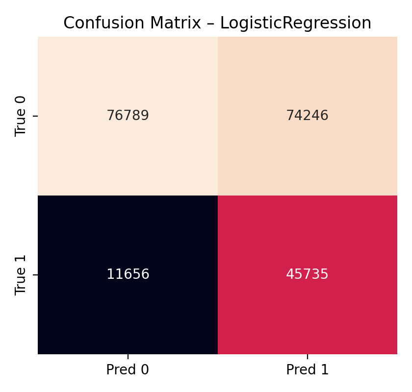

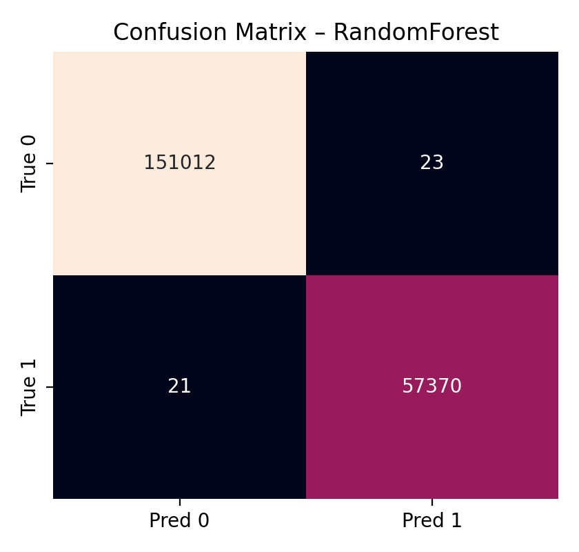
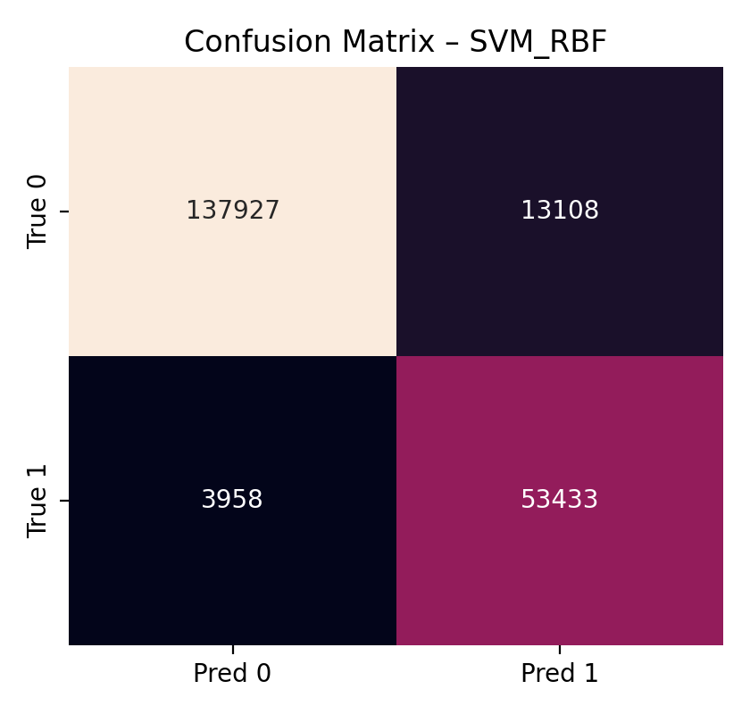
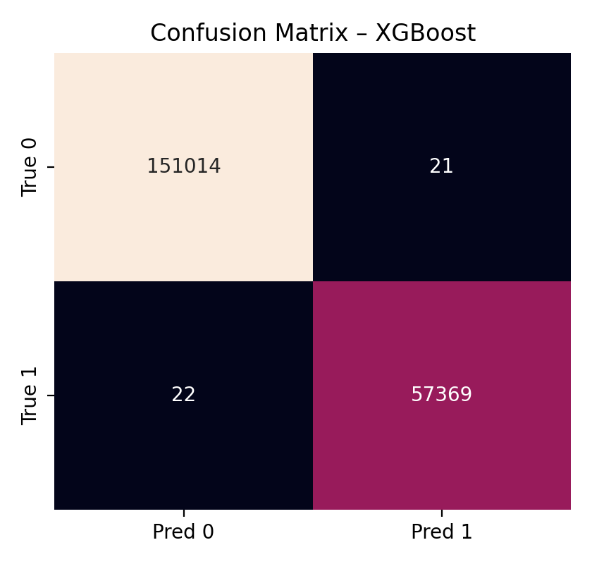

**Komentarz:**  
W CICIDS różnice są ogromne: LogReg generuje bardzo dużo FP, co potwierdza niską precyzję.  
DecisionTree/RF/XGBoost mają niemal zerowe FP i FN — czyli nie tylko są „dobre w AUC”, ale też działają świetnie w punkcie decyzyjnym.
SVM jest wyraźnie gorszy (FP i/lub FN są zauważalne), co przekłada się na gorszą accuracy.

#### UNSW-NB15: confusion matrices


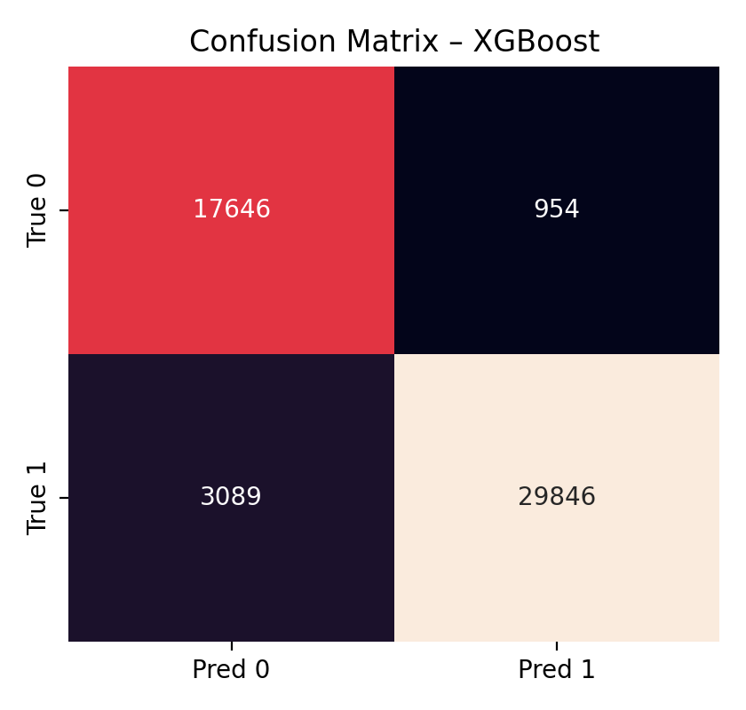

**Komentarz:**  
UNSW pokazuje typową sytuację: modele różnią się głównie balansem FP vs FN.
RF minimalizuje FN (ma wyższy recall), ale utrzymuje też wysoką precyzję — dlatego jest bardzo atrakcyjny w IDS.
XGBoost ma najwyższą precyzję (precision≈0.969), ale kosztem większej liczby FN (recall≈0.906).
To jest praktyczny trade-off: jeśli priorytetem jest „nie przegapić ataku”, RF jest bezpieczniejszy.
Jeśli priorytetem jest „nie spamować alertami”, XGBoost może być korzystniejszy.

---

### 4) Granice decyzyjne na PCA(2)

To są wykresy poglądowe: redukujemy dane do 2 wymiarów PCA i rysujemy granice decyzyjne.
To **nie jest** pełen obraz w 7D, ale pozwala zobaczyć, czy model zachowuje się „liniowo” czy „poszatkowanie”.

#### CICIDS2017: PCA decision boundaries
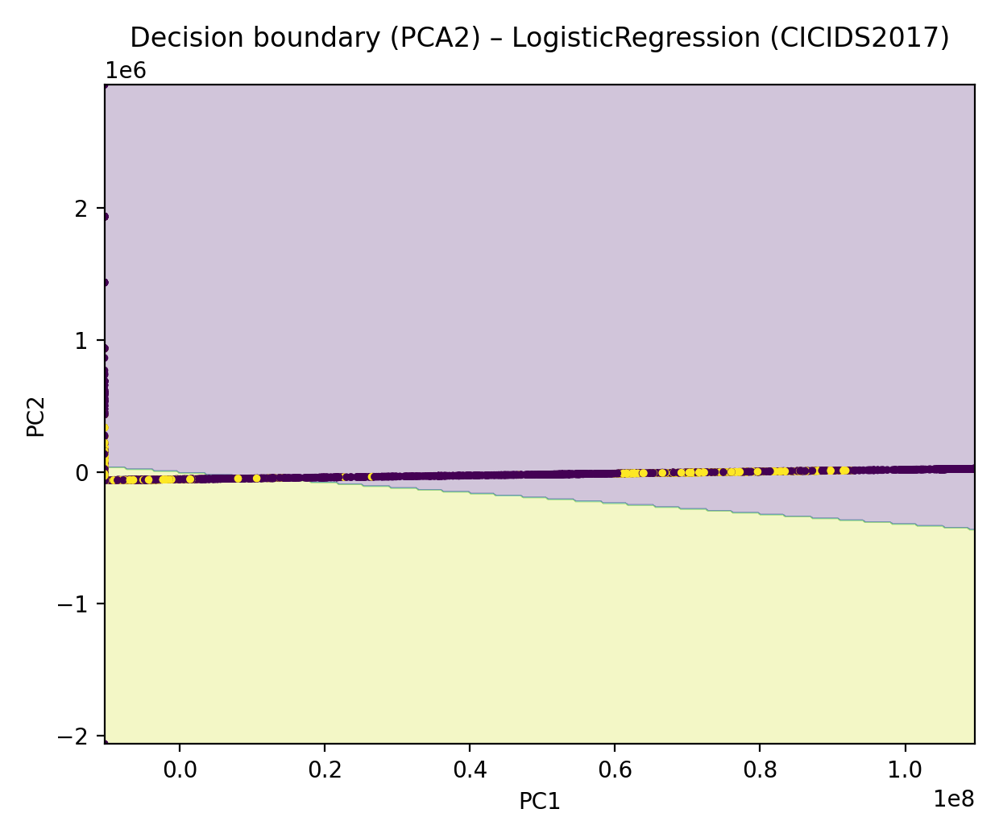


**Komentarz:**  
LogReg tworzy w PCA prawie liniową granicę, co może być niewystarczające, gdy klasy są „poskręcane” w przestrzeni cech.
Drzewo i boosting tworzą bardziej złożone, lokalne regiony decyzji.
RF zwykle wygładza „poszarpanie” pojedynczego drzewa przez uśrednianie, co przekłada się na stabilniejsze granice.

#### UNSW-NB15: PCA decision boundaries


**Komentarz:**  
Na UNSW widać większe nakładanie klas, a granice nieliniowe są bardziej uzasadnione.
Modele drzewiaste i SVM potrafią tworzyć regiony „otaczające” klasę ataku, co poprawia recall.
LogReg jest bardziej ograniczony i przez to zostawia część ataków po „złej stronie” granicy (FN).

---

### 5) Rozkłady cech: histogramy i KDE (UNSW + CICIDS)

Te wykresy pokazują, które cechy różnią klasy i czy rozkłady się nakładają.
Poniżej przykładowe zestawy (w `images/` jest ich więcej; w raporcie omawiamy te najważniejsze).

#### CICIDS — wybrane cechy (KDE)


**Komentarz:**  
Jeżeli KDE dla ataku jest przesunięte i ma małe nakładanie z normalnym ruchem, model ma łatwe zadanie.
DDoS i PortScan często generują ekstremalne wartości (np. dużo pakietów/s, dużo SYN), więc separacja bywa bardzo dobra,
co tłumaczy „prawie perfekcyjne” metryki dla drzew i boosting.

#### UNSW — wybrane cechy (KDE)


**Komentarz:**  
W UNSW rozkłady częściej się nakładają, dlatego wynik nie jest perfekcyjny.
Widać, że pojedyncza cecha rzadko daje idealny podział — modele muszą łączyć sygnały z wielu cech.
To tłumaczy, dlaczego RF/XGBoost (które potrafią łączyć cechy nieliniowo) poprawiają AUC tak mocno.

---

## Porównanie modeli i dyskusja

### 1) Dlaczego LogisticRegression jest słaby w CICIDS?

W CICIDS LogReg ma ogromną liczbę FP. To może wynikać z:
- nieliniowości zależności (reguły warunkowe),
- silnego niezbalansowania i ustawienia `class_weight="balanced"`, które przesuwa granicę w stronę wyższej czułości,
- cech, które mają rozkłady trudne do „jednej prostej” hiperpłaszczyzny.

W praktyce w IDS takie zachowanie jest niebezpieczne operacyjnie: system generuje zbyt dużo alertów, więc analitycy ignorują alarmy.

### 2) DecisionTree: świetna jakość, ale ryzyko przeuczenia

W CICIDS drzewo jest niemal perfekcyjne, co może oznaczać, że:
- dane mają bardzo wyraźne progi w cechach (np. Flow Packets/s > X → atak),
- albo istnieje ryzyko, że model dopasował się do specyfiki tych plików i przy innym ruchu będzie gorszy.

Dlatego w praktyce zawsze rozważa się kontrolę głębokości (`max_depth`) i walidację krzyżową.

### 3) RandomForest: stabilność i najlepszy kompromis

W UNSW RF ma najlepszy kompromis: wysokie AUC i wysokie recall bez dramatycznej utraty precision.
To jest właśnie siła baggingu: redukcja wariancji drzewa i lepsza generalizacja w szumie.

### 4) XGBoost: wysoka precyzja, ale trade-off FN/FP

W UNSW XGBoost ma najwyższą precyzję, ale mniejszy recall. To oznacza, że w warstwie decyzji (próg)
model jest „bardziej konserwatywny” w alarmowaniu. W zależności od polityki bezpieczeństwa może to być plus lub minus.

---

## Porównanie z danymi idealnymi (Zadanie 1)

W Zadaniu 1 (dane idealne) regresja logistyczna osiągała perfekcję, bo klasy były sztucznie separowalne.
To oznacza, że wystarczyła prosta, liniowa granica decyzji.

Zadanie 3 pokazuje „prawdziwy świat”:
- nawet dobry pipeline nie gwarantuje idealnej separacji,
- potrzebujemy modeli nieliniowych,
- a dodatkowo trzeba myśleć o kosztach FN/FP oraz interpretacji.

Najważniejszy wniosek porównawczy:
**to struktura danych determinuje, czy model liniowy wystarczy; w realnych IDS zwykle nie wystarczy.**

---

## Wnioski

1. **Modele drzewiaste (DecisionTree, RandomForest) wyraźnie poprawiają wyniki na danych rzeczywistych** względem baseline’u liniowego.  
2. **RandomForest jest najbezpieczniejszym wyborem praktycznym**: stabilny, odporny na szum, zwykle wysoki recall i AUC.  
3. **XGBoost może dawać najlepszą AUC / precision**, ale wymaga ostrożnego strojenia i może w niektórych ustawieniach
   poświęcać recall (więcej FN).  
4. **LogisticRegression jest dobry jako punkt odniesienia**, ale w realnych danych może generować zbyt wiele FP (CICIDS) lub mieć zbyt niską separację (UNSW).  
5. W systemach bezpieczeństwa konieczne jest patrzenie nie tylko na accuracy, ale przede wszystkim na **FN/FP**, PR-curve i koszty operacyjne.

---

## Porównanie modeli i podsumowanie

W Zadaniach 1–3 obserwujemy wyraźny wzrost trudności problemu:

- **Z1 (idealne):** klasy prawie rozłączne → model liniowy osiąga wyniki bliskie perfekcji.
- **Z2 (realistyczne):** niezbalansowanie + ataki subtle → kluczowe stają się wagi klas i dobór progu τ (koszt).
- **Z3 (rzeczywiste):** szum + nieliniowości → przewagę uzyskują modele drzewiaste i zespołowe (DT/RF), a dodatkowo benchmarkowo XGBoost.

Najważniejszy wniosek porównawczy: **w detekcji intruzów** nie wystarczy jedna „dobra” metryka (np. Accuracy lub AUC). W praktyce system trzeba dostroić pod koszty FN/FP, a wybór modelu powinien uwzględniać strukturę danych (liniowość vs nieliniowość), stabilność oraz odporność na szum.
